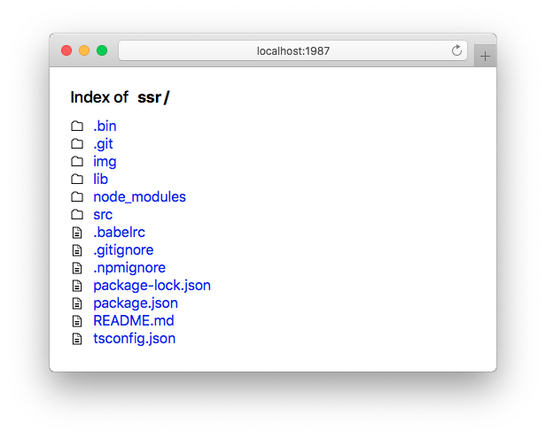

<p align="center">
  <a href="https://github.com/jaywcjlove/ssr">
    
  </a>
</p>

[](https://github.com/jaywcjlove/ssr/issues) [](https://github.com/jaywcjlove/ssr/network) [](https://github.com/jaywcjlove/ssr/stargazers) [](https://github.com/jaywcjlove/ssr/releases)


A dev server for rapid prototyping. It provides a neat interface for listing the directory's contents and switching into sub folders.

In addition, it's also awesome when it comes to serving static sites. If a directory contains an index.html, serve will automatically render it instead of serving directory contents, and will serve any .html file as a rendered page instead of file's content as plaintext.



**features**

- 🗂 Serve static content like scripts, styles, images from a directory
- 🖥 Reroute all non-file requests like `/` or `/admin` to a single file
- ♻️ Reload the browser when project files get added, removed or modified
- 📚 Readable source code that encourages learning and contribution
- 💥 Remove the redundancy [proxy](https://github.com/jaywcjlove/mocker-api) feature, Please use [mocker-api](https://github.com/jaywcjlove/mocker-api).
- 🙈 Preview the static page of the React/Vue/Angular project.

<br />

### Quick Start

Add ssr as a dev dependency using `npm i ssr -D` or run directly from the terminal:

```bash
npx ssr [--port] [--dir]
```

<br />

### Install

```
npm install -g ssr 
```

Command help:

```bash
Usage: ssr [options]

Options:
  --version      Show version number                                   [boolean]
  --port, -p     Set the port.                          [number] [default: 1987]
  --reload-port  Set the reload port.                  [number] [default: 19872]
  --reload, -r   browser from reloading when files change.
                                                       [boolean] [default: true]
  --dir, -d      Specified directory.                     [string] [default: ""]
  --browser, -b  Browser from opening when the server starts.
                                                       [boolean] [default: true]
  --fallback     The file served for all non-file requests.
                                                          [string] [default: ""]
  --help         Show help                                             [boolean]

Examples:

  $ ssr                      Start a dev server.
  $ ssr --no-browser         Prevents the browser from opening when the server
                             starts.
  $ ssr --no-reload          prevents the browser from reloading when files
                             change.
  $ ssr -p 2019              Designated port.
  $ ssr -d node_modules/dir  Designated port.

Copyright 2019
```
