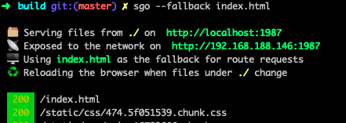
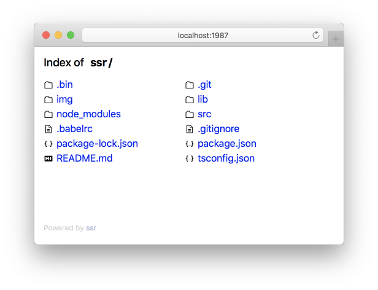

[简体中文](README-zh.md)

<p align="center">
  <a href="https://github.com/jaywcjlove/sgo">
    
  </a>
</p>

<p align="center">
  <a href="https://github.com/jaywcjlove/sgo/actions">
    
  </a>
  <a href="https://github.com/jaywcjlove/sgo/issues">
    
  </a>
  <a href="https://github.com/jaywcjlove/sgo/network">
    
  </a>
  <a href="https://github.com/jaywcjlove/sgo/stargazers">
    
  </a>
  <a href="https://github.com/jaywcjlove/sgo/releases">
    
  </a>
  <a href="https://www.npmjs.com/package/sgo">
    
  </a>
</p>



A dev server for rapid prototyping. It provides a neat interface for listing the directory's contents and switching into sub folders.

In addition, it's also awesome when it comes to serving static sites. If a directory contains an index.html, serve will automatically render it instead of serving directory contents, and will serve any .html file as a rendered page instead of file's content as plaintext.

> Rename: `ssr` => `sgo`  
> sgo: `Server Go`  

⚠️ `ssr` package has been donated to a certain [team](https://github.com/ykfe) in Ali.



#### `Features`

🗂 Serve static content like scripts, styles, images from a directory.  
🖥 Reroute all non-file requests like `/` or `/admin` to a single file.  
♻️ Reload the browser when project files get added, removed or modified.  
📚 Readable source code that encourages learning and contribution.  
💥 Remove the redundancy [proxy](https://github.com/jaywcjlove/mocker-api) feature, Please use [mocker-api](https://github.com/jaywcjlove/mocker-api).  
⚛️ Preview the static page of the React/Vue/Angular project.  

<br />

### Quick Start

Add sgo as a dev dependency using `npm i sgo -D` or run directly from the terminal:

```bash
npm install -g sgo # install sgo
sgo # Create server
# or
npx sgo [--port] [--dir]
```

<br />

### Command help

```bash
Usage: sgo [options]

Options:
  --version      Show version number                                   [boolean]
  --port, -p     Set the port.                          [number] [default: 1987]
  --reload-port  Set the reload port.                  [number] [default: 19872]
  --reload, -r   browser from reloading when files change.
                                                       [boolean] [default: true]
  --dir, -d      Specified directory.                     [string] [default: ""]
  --browser, -b  Browser from opening when the server starts.
                                                       [boolean] [default: true]
  --fallback     The file served for all non-file requests.
                                                          [string] [default: ""]
  --help         Show help                                             [boolean]

Examples:

  $ sgo                            Start a dev server.
  $ sgo --no-browser               Prevents the browser from opening when the
                                   server starts.
  $ sgo --no-reload                prevents the browser from reloading when
                                   files change.
  $ sgo --fallback dir/index.html  The file served for all non-file requests..
  $ sgo -p 2019                    Designated port.
  $ sgo -d node_modules/dir        Specified directory "node_modules/dir".

Copyright 2019
```

Example usage with npm scripts in a project's package.json file:

```json
{
  "scripts": {
    "start": "npx sgo -p 2019"
  }
}
```

<br />

### Used in Node.js

```js
const sgo = require('sgo');

// Create server
sgo.default({ port: 1987, dir: '' });
```

```js
import server from 'sgo';

// Create server
server({ port: 1987, dir: '' });
```

<br />

### License

MIT © [Kenny Wong](https://wangchujiang.com/)