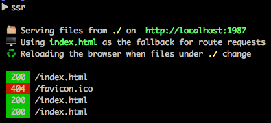
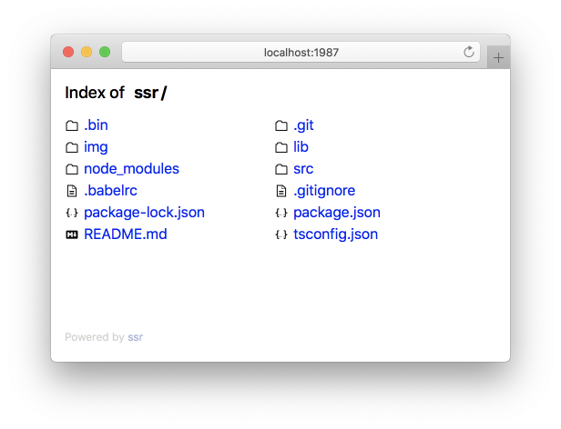

[简体中文](README-zh.md) • <ruby> [sgo](https://github.com/jaywcjlove/sgo-rs) <rt>rust</rt></ruby>

<div markdown="1">
  <sup>Using <a href="https://wangchujiang.com/#/app" target="_blank">my app</a> is also a way to <a href="https://wangchujiang.com/#/sponsor" target="_blank">support</a> me:</sup>
  <br>
  <a target="_blank" href="https://jaywcjlove.github.io/maslink/?id=6758053530" title="Scap: Screenshot & Markup Edit for macOS"></a>
  <a target="_blank" href="https://jaywcjlove.github.io/maslink/?id=6757317079" title="Screen Test for macOS"></a>
  <a target="_blank" href="https://jaywcjlove.github.io/maslink/?id=6755948110" title="Deskmark for macOS"></a>
  <a target="_blank" href="https://jaywcjlove.github.io/maslink/?id=6500434773" title="Keyzer for macOS"></a>
  <a target="_blank" href="https://github.com/jaywcjlove/vidwall-hub" title="Vidwall Hub for macOS"></a>
  <a target="_blank" href="https://jaywcjlove.github.io/maslink/?id=6752624705" title="VidCrop for macOS"></a>
  <a target="_blank" href="https://jaywcjlove.github.io/maslink/?id=6747587746" title="Vidwall for macOS"></a>
  <a target="_blank" href="https://wangchujiang.com/mousio-hint/" title="Mousio Hint for macOS"></a>
  <a target="_blank" href="https://jaywcjlove.github.io/maslink/?id=6746747327" title="Mousio for macOS"></a>
  <a target="_blank" href="https://jaywcjlove.github.io/maslink/?id=6745227444" title="Musicer for macOS"></a>
  <a target="_blank" href="https://jaywcjlove.github.io/maslink/?id=6743841447" title="Audioer for macOS"></a>
  <a target="_blank" href="https://jaywcjlove.github.io/maslink/?id=6744690194" title="FileSentinel for macOS"></a>
  <a target="_blank" href="https://jaywcjlove.github.io/maslink/?id=6743495172" title="FocusCursor for macOS"></a>
  <a target="_blank" href="https://jaywcjlove.github.io/maslink/?id=6742680573" title="Videoer for macOS"></a>
  <a target="_blank" href="https://jaywcjlove.github.io/maslink/?id=6740425504" title="KeyClicker for macOS"></a>
  <a target="_blank" href="https://jaywcjlove.github.io/maslink/?id=6739052447" title="DayBar for macOS"></a>
  <a target="_blank" href="https://jaywcjlove.github.io/maslink/?id=6739444407" title="Iconed for macOS"></a>
  <a target="_blank" href="https://jaywcjlove.github.io/maslink/?id=6737160756" title="Menuist for macOS"></a>
  <a target="_blank" href="https://jaywcjlove.github.io/maslink/?id=6723903021" title="Paste Quick for macOS"></a>
  <a target="_blank" href="https://jaywcjlove.github.io/maslink/?id=6670696072&platform=mac" title="Quick RSS for macOS/iOS"></a>
  <a target="_blank" href="https://jaywcjlove.github.io/maslink/?id=6670167443" title="Web Serve for macOS"></a>
  <a target="_blank" href="https://jaywcjlove.github.io/maslink/?id=6503953628&platform=mac" title="Copybook Generator for macOS/iOS"></a>
  <a target="_blank" href="https://jaywcjlove.github.io/maslink/?id=6471227008&platform=mac" title="DevTutor for macOS/iOS"></a>
  <a target="_blank" href="https://jaywcjlove.github.io/maslink/?id=6479819388&platform=mac" title="RegexMate for macOS/iOS"></a>
  <a target="_blank" href="https://jaywcjlove.github.io/maslink/?id=6479194014&platform=mac" title="Time Passage for macOS/iOS"></a>
  <a target="_blank" href="https://jaywcjlove.github.io/maslink/?id=6478772538" title="IconizeFolder for macOS"></a>
  <a target="_blank" href="https://jaywcjlove.github.io/maslink/?id=6478511402&platform=mac" title="Textsound Saver for macOS/iOS"></a>
  <a target="_blank" href="https://jaywcjlove.github.io/maslink/?id=6476924627" title="Create Custom Symbols for macOS"></a>
  <a target="_blank" href="https://jaywcjlove.github.io/maslink/?id=6476452351" title="DevHub for macOS"></a>
  <a target="_blank" href="https://jaywcjlove.github.io/maslink/?id=6476400184" title="Resume Revise for macOS"></a>
  <a target="_blank" href="https://jaywcjlove.github.io/maslink/?id=6472593276" title="Palette Genius for macOS"></a>
  <a target="_blank" href="https://jaywcjlove.github.io/maslink/?id=6470879005" title="Symbol Scribe for macOS"></a>
</div>
<hr>

<p align="center">
  <a href="https://github.com/jaywcjlove/sgo">
    
  </a>
</p>

<p align="center">
  <a href="https://jaywcjlove.github.io/#/sponsor"></a>
  <a href="https://x.com/jaywcjlove"></a>
  <a href="https://github.com/jaywcjlove/sgo/actions">
    
  </a>
  <a href="https://github.com/jaywcjlove/sgo/releases">
    
  </a>
  <a href="https://www.npmjs.com/package/sgo">
    
  </a>
</p>



A dev server for rapid prototyping. It provides a neat interface for listing the directory's contents and switching into sub folders.

In addition, it's also awesome when it comes to serving static sites. If a directory contains an index.html, serve will automatically render it instead of serving directory contents, and will serve any .html file as a rendered page instead of file's content as plaintext.

> Rename: `ssr` => `sgo`  
> sgo: `Server Go`  

⚠️ `ssr` package has been donated to a certain [team](https://github.com/ykfe) in Ali.



#### `Features`

🗂 Serve static content like scripts, styles, images from a directory.  
🖥 Reroute all non-file requests like `/` or `/admin` to a single file.  
♻️ Reload the browser when project files get added, removed or modified.  
📚 Readable source code that encourages learning and contribution.  
💥 Remove the redundancy [proxy](https://github.com/jaywcjlove/mocker-api) feature, Please use [mocker-api](https://github.com/jaywcjlove/mocker-api).  
⚛️ Preview the static page of the React/Vue/Angular project.  

<br />

### Quick Start

Add sgo as a dev dependency using `npm i sgo -D` or run directly from the terminal:

```bash
npm install -g sgo # install sgo
sgo # Create server
# or
npx sgo [--port] [--dir]
```

<br />

### Command help

```bash
Usage: sgo [options]

Options:
  --version      Show version number                                   [boolean]
  --port, -p     Set the port.                          [number] [default: 1987]
  --reload-port  Set the reload port.                  [number] [default: 19872]
  --reload, -r   browser from reloading when files change.
                                                       [boolean] [default: true]
  --dir, -d      Specified directory.                     [string] [default: ""]
  --browser, -b  Browser from opening when the server starts.
                                                       [boolean] [default: true]
  --fallback     The file served for all non-file requests.
                                                          [string] [default: ""]
  --help         Show help                                             [boolean]

Examples:

  $ sgo                            Start a dev server.
  $ sgo --no-browser               Prevents the browser from opening when the
                                   server starts.
  $ sgo --no-reload                prevents the browser from reloading when
                                   files change.
  $ sgo --fallback dir/index.html  The file served for all non-file requests..
  $ sgo -p 2019                    Designated port.
  $ sgo -d node_modules/dir        Specified directory "node_modules/dir".

Copyright 2019
```

Example usage with npm scripts in a project's package.json file:

```json
{
  "scripts": {
    "start": "npx sgo -p 2019"
  }
}
```

<br />

### Used in Node.js

```js
const sgo = require('sgo');

// Create server
sgo.default({ port: 1987, dir: '' });
```

```js
import server from 'sgo';

// Create server
server({ port: 1987, dir: '' });
```

<br />

### License

MIT © [Kenny Wong](https://wangchujiang.com/)