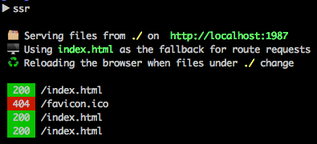

# ssr



将一个目录设置成一个静态服务器。。大家肯定遇到过，当后端 API 没有编写完成时，前端无法进行调试，这就导致了前端会被后端阻塞的情况。而ssr相当于是搭建了一个 Mock Server ，构建假数据，然后把这些假数据存到 JSON 文件上，Mock Server 可以响应请求或者生成页面，当然也可以顺便生成 API 文档。

- 强制跨域访问(AJAX请求不报错)
- 启动多个服务，自动解决`端口冲突`
- 设置指定端口号

## 全局安装

```
npm install -g ssr 
```

命令帮助。

```
Usage: ssr [options]

Options:
  --help, -h         Show help                                        
  --version, -V, -v  Show version number                              
  --port, -p         Set the port!
  --cors, -c         allows cross origin access serving
  --proxy            Local data mock                         [string]

  copyright 2015
```

命令使用 `ssr`  

```bash
$ ssr           # 默认 端口 1987   访问地址：=> http://localhost:1987
$ ssr -p 2015   # 端口设置 2015   访问地址：=> http://localhost:2015
$ ssr -cp 2015   #端口设置 2015  并且 可以跨域访问
```

**注意：** 默认不传端口，起多个服务不会发生端口冲突，尽情玩耍吧。


## 使用方法

- 建两个目录文件 `dir1` 和 `dir2` 
- 分别进入这两个目录使用`ssr`起服务
- `dir1` 运行`ssr -cp 1987` 起来之后为 `http://localhost:1987`，`dir2` 运行 `ssr -cp 2015` 起来之后地址为 `http://localhost:2015`


## 本地数据 mock

### 方法一

- 在 `dir1` 中存一个文件 `file` 里面是`JSON`数据格式
- 在 `dir2` 中存一个 `index.html` 通过 `jQuery` 去访问 `file` 文件返回 `JSON` 或者你输入`file`文件中的内容的内容

## 方法二

[proxy.config.js](example/proxy.config.js) 的配置方法：

```js

module.exports = {
    // Mock 数据返回
    'GET /users': [{name:'kenny wang'}, {name:'JSLite doc'}],
    'GET /users/1': {name:'JSLite api'},
    'POST /users':{name:'JSLite'},
    'POST /users/2':"22323sd",
    'POST /users':function(data,url){
        // data 接受传递数据
        // url 请求
        // 接受
        // - form-data
        // - x-www-form-urlencoded
        // - raw
        if(data.name === 'jslite'){
            return {name:'卧槽121221'}
        }else{
            return {name:'yyy'}
        }
    }
};

```

使用方法

```bash
$ ssr --proxy example/proxy.config.js -p 19992
```

## 当前目录安装

```bash
npm install ssr
```

nodejs 中应用，这个在 [idoc文档生成工具中应用过了](https://github.com/jaywcjlove/idoc)

```js
var ssr = require('ssr');
    ssr(1998);
```
